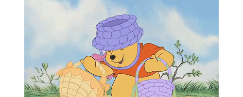
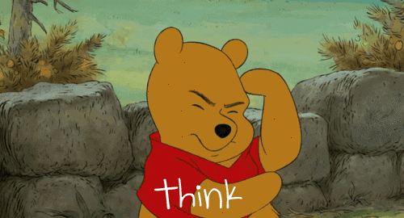
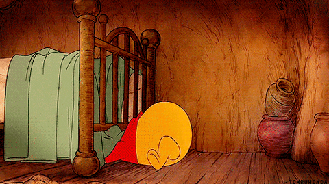

# Tech Madi 👋

 
 
 

- 👋 Hi, I’m Madi
- 💼 I'm a  Frontend Engineer at PeerCarbon
- 👯 I’m looking to collaborate on frontend software engineering projects

## :art: My Stats :

 
  
<b>💻 GitHub Profile Stats</b>

   
  

    
 
   
  

    
 
 
  

  
<b>⚡ Recent GitHub Activity</b>

   
   
   

 

## :film_projector: Popular Projects
Coming Soon

<a >
  <!-- Change the `github-readme-stats.anuraghazra1.vercel.app` to `github-readme-stats.vercel.app`  -->

[//]: # (  )
</a>  

<a >
  <!-- Change the `github-readme-stats.anuraghazra1.vercel.app` to `github-readme-stats.vercel.app`  -->

[//]: # (  )
</a> 

## :call_me_hand: Contact Me

  

If you want to reach out to me about anything, be it some doubt or just to hangout and talk or want to  design together just ping me 😉.

<a href="https://www.linkedin.com/in/TechMadi/">
  
 
 
 
</a>

 

 

## :eyes: Found Me :

  

 

